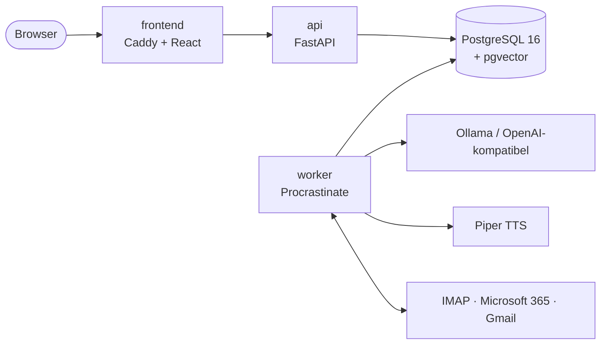

<div align="center">

# ollamail

**Selbst gehostete E-Mail-Analyse mit lokaler KI.**<br>
Triage, Aufgaben, Audio-Digest und „Frag deine Inbox“ – ohne dass eine Mail dein Netz verlässt.

[](https://github.com/dusseligerdussel/ollamail/actions/workflows/ci.yml)
[](https://github.com/dusseligerdussel/ollamail/actions/workflows/security.yml)
[](https://github.com/dusseligerdussel/ollamail/releases/latest)
[](LICENSE)

[](https://github.com/dusseligerdussel?tab=packages&repo_name=ollamail)
[](docs/OPERATIONS.md#3-hardware-profile-und-llm)
[](docs/operations/truenas.md)
[](docs/operations/kubernetes.md)
[](docs/PRIVACY.md)

[Schnellstart](#schnellstart) ·
[Funktionen](#funktionen) ·
[Installation](#installation) ·
[Dokumentation](#dokumentation) ·
[Changelog](CHANGELOG.md)

</div>

<div align="center">

<picture>
  <source media="(prefers-color-scheme: dark)" srcset="https://github.com/dusseligerdussel/ollamail/blob/2a6671184c3450d154862fdb7b11d891cb091662/claude-stoic-dijkstra-o63erc/inbox-dark.png?raw=true">
  
</picture>

</div>

## Warum ollamail?

- **Local first.** Läuft komplett auf eigener Hardware – mit [Ollama](https://ollama.com) auch nur
  auf der CPU. Cloud-LLMs sind Opt-in und vom Admin global abschaltbar.
- **DSGVO by design.** Keine Mail-Inhalte, Betreffzeilen oder Adressen in Logs. Zugangsdaten
  verschlüsselt, Audit-Log, Aufbewahrungsfristen, Datenexport und Kontolöschung.
- **Für Einzelne und Teams.** Vom Homelab bis zum Unternehmen: Entra ID, Google, GitHub, OIDC,
  LDAP/AD, SAML und SCIM; geteilte Postfächer mit Rechten.
- **Schlicht.** Eine ruhige Oberfläche in Deutsch und Englisch, hell und dunkel, mit
  Tastaturkürzeln und Befehlsmenü – ohne Glitzer und „✨ AI“-Knöpfe.

## Funktionen

| | |
|---|---|
| **Triage** | Kategorien und Priorität je Mail mit Begründung. Absenderregeln, Vorfilter für Newsletter und Benachrichtigungen; lernt aus deinen Korrekturen. Optional als Label/Ordner zurück ins Postfach. |
| **Aufgaben** | Erkennt To-dos in Mails und sammelt sie an einem Ort. Export nach CalDAV, Microsoft To Do und Google Tasks. |
| **Frag deine Inbox** | Hybrid-Suche (Volltext + Embeddings) über Mails und Anhänge, inklusive OCR für gescannte PDFs. Antworten mit Quellenangaben. |
| **Daily Digest** | Zusammenfassung der letzten Mails als Text und Audio (Piper-TTS, Deutsch und Englisch) – im Web-Player oder als privater Podcast-Feed. |
| **Antwortentwürfe** | Vorschläge für Antworten, die du prüfst, anpasst und über SMTP, Graph oder die Gmail-API sendest. |
| **Benachrichtigungen** | Browser- und Web-Push-Hinweise für gewählte Kategorien – standardmäßig ohne Betreff. |
| **Postfächer** | IMAP (mit IDLE und Autodiscovery), Microsoft 365 (Graph), Gmail / Google Workspace. |
| **Betrieb** | Docker Compose, Multi-Arch-Images (amd64/arm64), Helm-Chart, TrueNAS-SCALE-App, Prometheus-Metriken, Backup- und Upgrade-Anleitung. |

<table>
  <tr>
    <td width="50%" valign="top">
      <b>Frag deine Inbox</b> – Antwort mit Quellen<br><br>
<picture>
  <source media="(prefers-color-scheme: dark)" srcset="https://github.com/dusseligerdussel/ollamail/blob/2a6671184c3450d154862fdb7b11d891cb091662/claude-stoic-dijkstra-o63erc/search-dark.png?raw=true">
  
</picture>
    </td>
    <td width="50%" valign="top">
      <b>Daily Digest</b> – zum Lesen und Anhören<br><br>
<picture>
  <source media="(prefers-color-scheme: dark)" srcset="https://github.com/dusseligerdussel/ollamail/blob/2a6671184c3450d154862fdb7b11d891cb091662/claude-stoic-dijkstra-o63erc/digest-dark.png?raw=true">
  
</picture>
    </td>
  </tr>
  <tr>
    <td width="50%" valign="top">
      <b>Aufgaben</b> – aus Mails erkannt, nach Fälligkeit<br><br>
<picture>
  <source media="(prefers-color-scheme: dark)" srcset="https://github.com/dusseligerdussel/ollamail/blob/2a6671184c3450d154862fdb7b11d891cb091662/claude-stoic-dijkstra-o63erc/todos-dark.png?raw=true">
  
</picture>
    </td>
    <td width="50%" valign="top" align="center">
      <b>Mobil</b> – dieselbe App auf dem Handy<br><br>
      
    </td>
  </tr>
</table>

<sub>Alle Screenshots mit Testdaten. Die Bilder folgen dem hellen oder dunklen Modus von GitHub.</sub>

### Analyse-Werkzeug, kein Mail-Client

ollamail liest Postfächer und wertet sie aus. Für die tägliche Triage gibt es die wichtigsten
Aktionen; alles Weitere – Ordner anlegen, neue Mails verfassen, Regeln, endgültig löschen –
bleibt im Mail-Client. Auf den Server zurück gehen nur diese Aktionen, jeweils erst nach einem
Klick bzw. Tastendruck:

- **Gelesen/ungelesen** und **Markieren** (Flag bzw. Stern)
- **Archivieren**, **Verschieben**, **In den Papierkorb** – mit „Rückgängig“; endgültig gelöscht wird nichts
- **Antworten senden** – nur aus eigenen Postfächern
- **Triage-Kategorie als Label oder Ordner** – nur, wenn pro Postfach eingeschaltet

In geteilten Postfächern braucht es dafür das Recht „Mails verwalten“.
Details: [Architektur §3.1](docs/ARCHITECTURE.md#mail-aktionen-auf-dem-server).

## Schnellstart

Voraussetzungen: Linux-Host mit Docker Engine und Compose v2.24+, `git` und `openssl`.
Die fertigen Images kommen aus der GitHub Container Registry.

```sh
git clone https://github.com/dusseligerdussel/ollamail.git && cd ollamail

# Konfiguration mit frischen Secrets
cp deploy/.env.example deploy/.env && chmod 600 deploy/.env
sed -i "s|^OLLAMAIL_SECRET_KEY=.*|OLLAMAIL_SECRET_KEY=$(openssl rand -base64 32)|" deploy/.env
sed -i "s|^POSTGRES_PASSWORD=.*|POSTGRES_PASSWORD=$(openssl rand -hex 24)|" deploy/.env

# Stack starten, mit lokalem Ollama (CPU) und den Modellen des Profils `cpu`
docker compose -f deploy/compose.yaml --profile ollama-cpu up -d --wait
docker compose -f deploy/compose.yaml exec ollama-cpu ollama pull qwen2.5:3b
docker compose -f deploy/compose.yaml exec ollama-cpu ollama pull bge-m3

# Setup-Code für den ersten Admin
docker compose -f deploy/compose.yaml exec api python -m app.cli setup-token
```

Dann <http://localhost:8080> öffnen, mit dem Setup-Code den ersten Admin anlegen und unter
**Einstellungen → Postfächer** ein Postfach verbinden.

> [!NOTE]
> Die UI lauscht standardmäßig nur auf dem Host selbst (`OLLAMAIL_HTTP_BIND=127.0.0.1`).
> Für den Zugriff über das Netz gehört TLS davor – Sitzungs-Cookies sind `Secure`, über
> `http://<LAN-IP>:8080` schlagen Setup und Anmeldung deshalb fehl. Reverse Proxy und Testbetrieb
> ohne TLS: [Betrieb §2.6 und §4](docs/OPERATIONS.md#4-reverse-proxy-und-tls).

## Installation

| Plattform | Weg | Anleitung |
|---|---|---|
| **Docker Compose** | Fertige Images oder lokaler Build, Ollama gebündelt (CPU/NVIDIA) oder extern | [`docs/OPERATIONS.md`](docs/OPERATIONS.md) |
| **TrueNAS SCALE** (24.10+) | *Apps → Discover Apps → Install via YAML* mit [`deploy/truenas/compose.yaml`](deploy/truenas/compose.yaml) | [`docs/operations/truenas.md`](docs/operations/truenas.md) |
| **Kubernetes** | Helm-Chart in [`deploy/helm/ollamail`](deploy/helm/ollamail), CloudNativePG oder eigenes PostgreSQL | [`docs/operations/kubernetes.md`](docs/operations/kubernetes.md) |

**Hardware:** Der Basis-Stack ist schlank; das LLM braucht den Großteil. Auf CPU genügt
`qwen2.5:3b` (Triage und Aufgaben etwa 20–60 s pro Mail), mit GPU sind größere Modelle möglich.
Profile und Richtwerte: [Betrieb §3](docs/OPERATIONS.md#3-hardware-profile-und-llm).

**Images:** `ghcr.io/dusseligerdussel/ollamail-api` und `ollamail-frontend` für `linux/amd64` und
`linux/arm64`, mit SBOM und SLSA-Provenance. Tags: `0.1.0`, `0.1`, `latest`, `edge`
(nächtlich) – siehe [`deploy/README.md`](deploy/README.md#images).

## Architektur



PostgreSQL ist zugleich Datenbank, Volltext- und Vektorindex und Job-Queue – es gibt keinen
weiteren Dienst zu betreiben. Mail, LLM und TTS hängen an austauschbaren Provider-Schnittstellen.
Mehr in [`docs/ARCHITECTURE.md`](docs/ARCHITECTURE.md).

| Bereich | Technik |
|---|---|
| Backend |     |
| Daten |    |
| Frontend |      |
| KI |    |
| Tooling |       |

## Status

> [!IMPORTANT]
> **v0.1.0 ist die erste Version.** Vor 1.0 können sich Konfiguration und API noch ändern.
> Microsoft 365, Gmail, SAML und SCIM sind gegen nachgebaute APIs getestet, nicht gegen echte
> Mandanten. Alle bekannten Einschränkungen stehen im [Changelog](CHANGELOG.md#bekannte-einschränkungen),
> die Planung in der [Roadmap](docs/ROADMAP.md).

## Dokumentation

| | |
|---|---|
| [Betrieb](docs/OPERATIONS.md) | Installation, Reverse Proxy, Backup, Updates, Skalierung, Troubleshooting |
| [TrueNAS](docs/operations/truenas.md) · [Kubernetes](docs/operations/kubernetes.md) | Plattform-spezifische Installation |
| [Architektur](docs/ARCHITECTURE.md) | Aufbau, Datenmodell, Provider, Mail-Aktionen |
| [Datenschutz & Sicherheit](docs/PRIVACY.md) | DSGVO, Verschlüsselung, Logging, Löschkonzept |
| [Anmeldung](docs/auth/admin.md) | [OIDC](docs/auth/oidc.md), [GitHub](docs/auth/github.md), [LDAP](docs/auth/ldap.md), [SAML](docs/auth/saml.md), [SCIM](docs/auth/scim.md), [MFA](docs/auth/mfa.md) |
| [Postfächer](docs/providers/microsoft365.md) | [Microsoft 365](docs/providers/microsoft365.md), [Gmail](docs/providers/gmail.md) |
| [Design](docs/DESIGN.md) · [Barrierefreiheit](docs/accessibility.md) | Gestaltungsregeln der Oberfläche |
| [Roadmap](docs/ROADMAP.md) · [Changelog](CHANGELOG.md) | Planung und Versionen |

## Mitmachen

Fehler und Ideen gern als [Issue](https://github.com/dusseligerdussel/ollamail/issues).
Für Code gelten die Regeln in [`CLAUDE.md`](CLAUDE.md) – für Menschen wie für Agenten:
eigener Branch je Issue, Pull Request gegen `main`, grüne CI (`ci-ok`), Conventional Commits.

```sh
# Backend
cd backend && uv sync && uv run ruff check . && uv run mypy app && uv run pytest
# Frontend
cd frontend && pnpm install && pnpm lint && pnpm typecheck && pnpm test && pnpm e2e
```

## Lizenz

ollamail steht unter der [GNU Affero General Public License v3.0](LICENSE).
